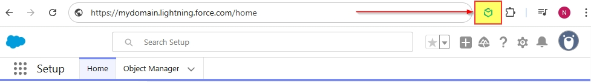
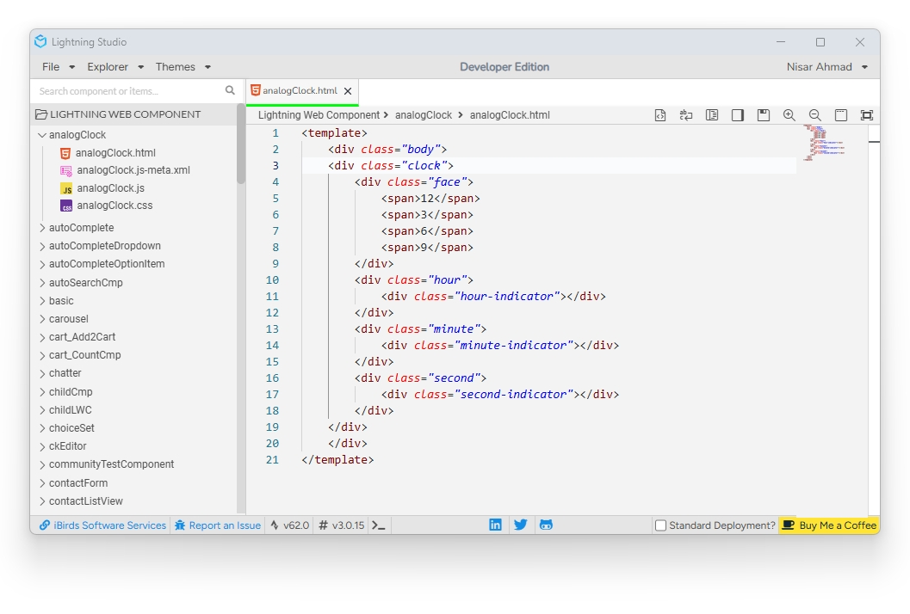
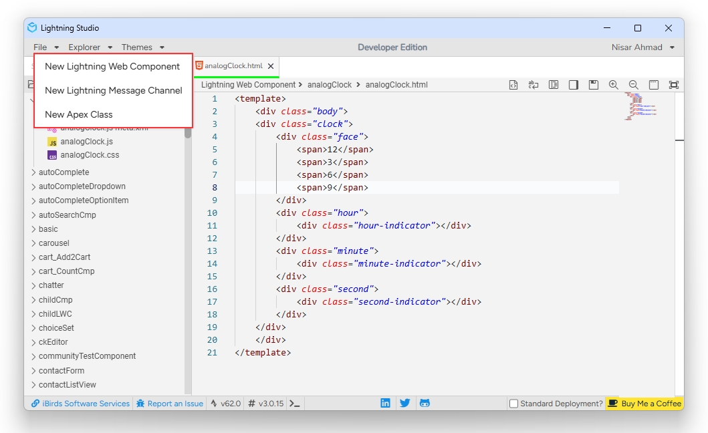
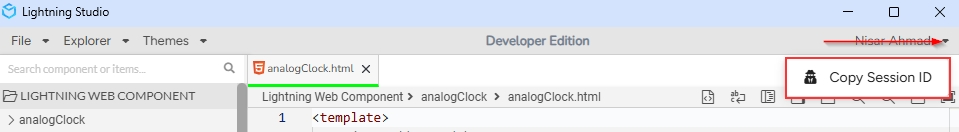
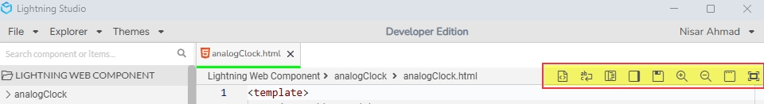
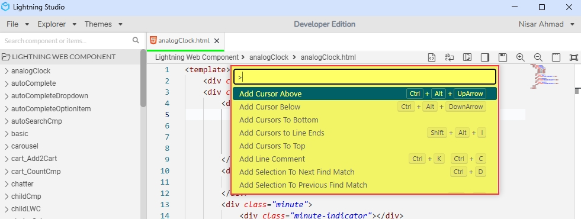
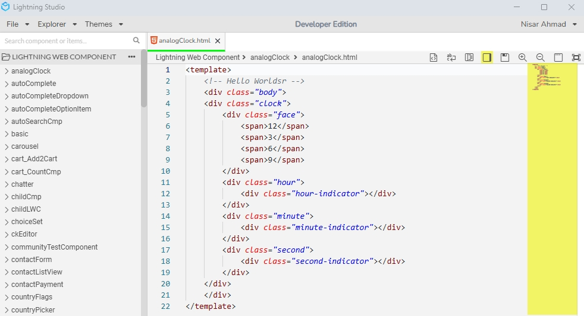
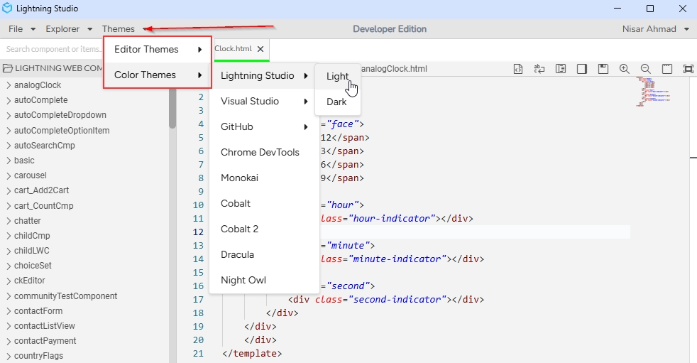

# Documentation

> User guide for using the extension.

Salesforce made a great move by making the Web Components part of the eco system by
introducing Lightning Web Component(LWC). But for some reason, they decided not to provide
the ability to code it directly from their developer console. Currently the only way to do
it is, is by using the VS Code & Code builder. This is great, but if you’re in a hurry and
want to make some quick changes, it won’t be easy.

## Getting Started

1. Log in to Salesforce and click the Lightning Studio icon located in the browser’s top-right corner (Standard Chrome extension toolbar).
2. Wait for the icon to turn blue, indicating it’s ready to use.
3. For first-time installations, refresh the page before accessing the extension.

Before you start using the app, ensure that you have:

- **Salesforce access**: You need admin access to a Salesforce account and permission to edit/update LWC and apex classes.
- **App access**: The LightningStudio app should be installed and available to you.

---

## Editor Interface 

The Lightning Studio editor interface is thoughtfully organized to optimize your development workflow, with three key areas:

**Sidebar**

The sidebar provides quick access to essential project navigation and search tools:

- **Search Panel:** Perform fast, project-wide text or symbol searches
- **File Explorer:** Browse, open, and manage all files and folders in your project

**Main Editor Area**

This is where you write and edit your code. Features include:

- Tabbed editing for multiple open files
- Syntax highlighting and IntelliSense for smarter coding
- Toolbar with actions like formatting, saving, and zooming

**Footer**

The footer displays important environment and editor information:

- **Connected Org Name**: Shows the Salesforce org you’re currently connected to
- **Salesforce API Version**: Indicates the API version used for deployments and metadata operations
- **Editor Version**: Displays the current version of Lightning Studio
- **Standard Deployment Checkbox**: Allows toggling standard deployment options before pushing changes

## Editor Features

### File Menu

The File menu in Lightning Studio provides quick access to creating essential Salesforce development components.

**Available Options:**

- New Lightning Web Component
    - Create a new Lightning Web Component (LWC), the modern UI building block for Salesforce applications. This includes a `.html`, `.js`, and `.js-meta.xml` (optional: `.css` and `.svg`) file scaffolded for immediate development.
- New Lightning Message Channel
    - Create a new Lightning Message Channel, which allows communication between Lightning Web Components using the Lightning Message Service (LMS). Ideal for loosely coupled component interaction across the DOM or different namespaces.
- New Apex Class
    - Create a new Apex Class, which is a server-side, object-oriented class used to execute logic, manage data operations, and handle integrations within Salesforce.

**Copy Session ID**: A session Id is used to identify a user using salesforce UI or API tools, it has a time limit and can be manually expired by the user logging out or by an admin removing that session in Setup.

---

## Toolbar Buttons
 

1. **Source Code Formatting**

    - Lightning Studio offers robust support for source code formatting, making it easy to keep your code clean and consistent. The editor provides two formatting actions:
        - **Format Document** – Formats the entire file.
        - **Format Selection** – Formats only the selected lines or block of code.
    - You can access these actions via:
        - The Command Palette `(fn + F1)`
        - The editor context menu (right-click inside the editor)

2. **Word Wrap**

    - Word Wrap is a feature that automatically moves words that don’t fit at the end of a line to the beginning of the next line, ensuring that text stays within the visible bounds of the editor.
    - In Lightning Studio, you can easily toggle Word Wrap for the current editor session using the Word Wrap button in the editor toolbar.

3. **Command Palette**

    The Command Palette gives you quick access to a wide range of actions and features in Lightning Studio—all from a single interactive window. With the Command Palette, you can:
    
    - Execute editor commands
    - View a quick outline of the current file
    - Search for symbols
 
    **Tip**: _Press `fn + F1` to open the Command Palette. From there, simply start typing the name of a file, symbol, or command to navigate or execute actions efficiently._

    

4. **Minimap**

    The Minimap provides a high-level overview of your source code along the right edge of the editor, similar to what you find in Visual Studio Code. It displays a condensed, scrollable preview of your entire file, helping you navigate large files quickly.
    **Key Features:**

    - Code overview at a glance
    - Click to scroll directly to any part of the file
    - Highlights your current view and cursor position
    - Reflects syntax highlighting for easier scanning
 
 

5. **Save**

    The Save action stores the currently open file to the database, ensuring your changes are preserved. You can save your work in two ways: 
    - Click the **Save** button in the editor toolbar
    - Use the keyboard shortcut: `Ctrl + S` (or `Cmd + S` on macOS)
  
  Saving regularly helps prevent data loss and keeps your project up to date.

6. **Zoom In / Zoom Out**

    Lightning Studio allows you to easily adjust the font size in the editor using on-screen Zoom controls—no need for shortcuts or commands.
    
    **How to Use:**  
    - Click the **Zoom In (+)** button to increase the font size
    - Click the **Zoom Out (–)** button to decrease the font size

  These buttons are located in the editor toolbar, making it simple to adjust text size to your comfort level without leaving the editor interface.

6. **Zen Mode**

    Zen Mode in Lightning Studio provides a distraction-free coding environment by hiding all non-essential UI elements. It’s ideal for deep focus sessions.

    **What Zen Mode Does:**  
    - Hides the sidebar, status bar, and tabs
    - Expands the editor to full screen
    - Maximizes vertical space for code

    **How to Enable:**  
    

  Click the Zen Mode button in the editor toolbar to toggle it on or off. Zen Mode helps you focus entirely on your code without visual clutter.

6. **Full-Screen Mode**

    Full-Screen Mode allows you to expand Lightning Studio to occupy the entire screen—just like the fullscreen feature in Chrome or other modern browsers.

    **Key Benefits:**  
    - Removes browser UI (tabs, address bar, etc.)
    - Maximizes workspace for coding
    - Ideal for presentations or focused development

    **How to Enable:**  
    
  Click the Full-Screen button in the top-right corner of the interface (or use your system’s native fullscreen control).
  To exit, press `Esc` or use the same button again.

---

## Themes

Lightning Studio supports both Light and Dark themes, along with a wide variety of additional themes to suit your preferences.

**Key Features:**
 - Light and Dark Modes for comfortable viewing in any lighting
 - A cool collection of pre-installed themes to choose from
 - Instantly switch themes for a personalized coding experience

**How to Change Theme:**
 - Click the Theme Switcher button in the toolbar
 - Use the dropdown list to browse available themes
 - Your selection is applied instantly—no reload required

_Whether you prefer high contrast, muted tones, or something vibrant, Lightning Studio has a theme to match your style._